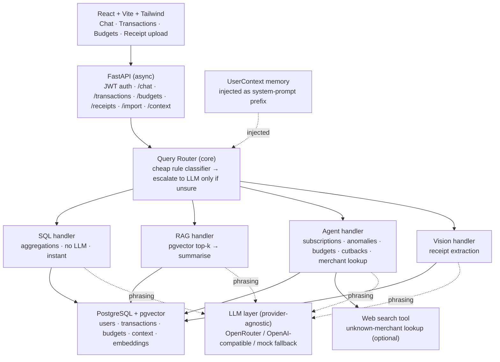

# Personal Finance Assistant

An AI-driven, multi-user financial companion. Users sign in, bring in their
transaction history (CSV or a mock bank), and **talk to an assistant in plain
language** about their money — including uploading a photo of a receipt.

This repo is my submission for the Full-Stack AI Engineer take-home. The brief
is deliberately open-ended, so most of the interesting work is in **how the
system routes each request to the cheapest capable strategy**, how it **handles
arbitrarily large histories without stuffing them into a prompt**, and how it
**degrades gracefully** on messy input, missing services, and dead ends.

> **TL;DR — runs with zero API keys.** With no LLM key configured the app falls
> back to a deterministic "mock" layer, so the entire product (auth, import,
> routing, all 10 capabilities, receipt flow) is demoable offline. Add an
> OpenRouter/OpenAI key to get fluent natural-language phrasing and real vision.

---

## 1. What it does (the 10 capabilities)

Each user expectation from the brief maps to a deliberate strategy — they are
**not** all the same kind of work, and the system treats them differently:

| # | Capability | How it's handled | Cost |
|---|------------|------------------|------|
| 1 | Answer spending questions | **SQL handler** — indexed Postgres aggregates | no LLM |
| 2 | Read a receipt photo | **Vision handler** — vision model → structured extract → recorded expense | 1 vision call |
| 3 | Surface subscriptions | **Agent tool** — cadence + amount-stability heuristic over history | no LLM |
| 4 | Flag unusual activity | **Agent tool** — per-user, per-category z-score baseline | no LLM |
| 5 | Compare across time | **SQL handler** — monthly rollups, this-month vs trailing average | no LLM |
| 6 | Track a budget | **Agent tool** — live spend vs limit, warning thresholds | no LLM |
| 7 | Look up unfamiliar charges | **Agent (multi-step)** — locate charge → web search → explain (with recovery) | optional web + 1 LLM |
| 8 | Plain-English summary | **SQL handler** + narration | 1 cheap LLM |
| 9 | Suggest where to cut back | **Agent tool** — this month vs trailing 3-month norm + subscriptions | no LLM |
| 10 | Remember user context | **Memory** — durable facts injected as a system-prompt prefix | no LLM |

The recurring theme: **numbers come from SQL/tools, words come from the LLM.**
The model never invents figures, and the expensive model is only used where it
genuinely adds value (agentic reasoning, vision, phrasing).

---

## 2. Architecture



The router is the heart of the system. A **fast keyword classifier** runs on
every message (sub-millisecond, zero cost) and only escalates to a cheap LLM
call when it is genuinely unsure. This is the concrete answer to *"match the
right level of effort to each task"* and *"economical to run"* — answering
"how much did I spend on groceries last month" costs **nothing** beyond a SQL
query.

See [`docs/ARCHITECTURE.md`](docs/ARCHITECTURE.md) for the deep dive and
[`docs/DECISIONS.md`](docs/DECISIONS.md) for trade-offs and stack justification.

---

## 3. Tech stack & why

| Layer | Choice | Why |
|-------|--------|-----|
| API | **FastAPI + Uvicorn (async)** | First-class async for high concurrency under many users; auto OpenAPI docs; minimal boilerplate. |
| ORM | **SQLModel (SQLAlchemy 2.0 async)** | Pydantic + SQLAlchemy in one model; async engine via asyncpg. |
| DB | **PostgreSQL + pgvector** | One store for relational *and* vector data — aggregates and semantic search without a second system. |
| Migrations | **Alembic** | Standard, reviewable schema versioning. |
| Auth | **JWT (python-jose + passlib/bcrypt)** | Auth is commodity; kept self-contained so the repo runs offline. Swappable for Clerk/Auth0 (see below). |
| LLM | **Provider-agnostic, OpenAI-compatible** | Works with OpenRouter, OpenAI, Together, Ollama, etc. via config only — and a deterministic mock fallback. |
| Frontend | **React + Vite + TypeScript + Tailwind** | Fast DX, typed, clean modern UI. |

**Why not the exact stack in the original diagram?** The diagram hard-coded
Anthropic Haiku/Sonnet. The requester has no Anthropic key and wants
provider-flexibility, so the model tiers became **configuration** (`LLM_ROUTER_MODEL`,
`LLM_AGENT_MODEL`, `LLM_VISION_MODEL`) behind an OpenAI-compatible client. The
"cheap model for routing, strong model for agent/vision" idea is preserved.

---

## 4. Repository layout

```
backend/
  app/
    api/          # FastAPI routers (auth, chat, transactions, budgets, receipts, import, context)
    auth/         # JWT + password hashing + current-user dependency
    handlers/     # sql / rag / agent / vision  (one per kind of work)
    llm/          # provider-agnostic client + embeddings (with offline fallbacks)
    router/       # intent classifier + orchestrator + narration
    services/     # ingestion (messy CSV), categorize, periods, memory
    tools/        # deterministic finance tools (spending, subscriptions, anomalies, budgets, cutbacks, web_search)
    models.py     # SQLModel tables
    config.py     # env-driven settings
    db.py         # async engine/session + init_db
    seed.py       # demo user + data
  alembic/        # migrations
  data/           # sample (intentionally messy) CSV
  tests/          # pure-logic unit tests (parser, router, periods)
frontend/
  src/            # React app (auth, dashboard, chat, transactions, budgets, memory)
docs/             # ARCHITECTURE.md, DECISIONS.md
docker-compose.yml# optional: Postgres+pgvector container
```

---

## 5. Setup & running

### Prerequisites
- **Python 3.11+**
- **Node 18+**
- **PostgreSQL 14+ with the `pgvector` extension** (local). If you'd rather not
  install it, run `docker compose up -d` to get a ready `pgvector/pgvector` DB
  matching the default connection string.

### 5.1 Database
Create a database called `finance` (or edit `DATABASE_URL`). pgvector must be
available; the app runs `CREATE EXTENSION IF NOT EXISTS vector` automatically on
startup, but the extension package must be installed on the server.

```bash
# Option A: your own local Postgres
createdb finance
# pgvector must be installed; in psql:  CREATE EXTENSION vector;

# Option B: containerised DB (optional)
docker compose up -d
```

### 5.2 Backend
```bash
cd backend
python -m venv .venv && source .venv/bin/activate    # Windows: .venv\Scripts\activate
pip install -r requirements.txt

cp .env.example .env        # then edit DATABASE_URL / JWT_SECRET (and LLM key if you have one)

# Seed a demo user + 12 months of data + the sample CSV (creates tables too):
python -m app.seed

# Run the API
uvicorn app.main:app --reload --port 8000
```
API docs: http://localhost:8000/docs · health: http://localhost:8000/api/health

> Tables are auto-created on startup (`init_db`) for a one-command setup.
> For production, use Alembic instead: `alembic upgrade head`.

### 5.3 Frontend
```bash
cd frontend
npm install
npm run dev          # http://localhost:3000  (proxies /api → :8000)
```

### 5.4 Log in
Use the seeded demo account, or register your own:
- **email:** `demo@finance.app`  **password:** `demo1234`

---

## 6. Running with vs without an LLM

- **No key (default):** `LLM_API_KEY` empty → mock mode. Routing uses the rule
  classifier, answers are built deterministically from real SQL results (correct
  numbers, plainer wording), and receipt upload is stored as "pending" with a
  clear message. Everything is testable.
- **With a key (recommended):** set in `backend/.env`:
  ```env
  LLM_PROVIDER=openrouter
  LLM_BASE_URL=https://openrouter.ai/api/v1
  LLM_API_KEY=sk-or-...
  LLM_ROUTER_MODEL=anthropic/claude-3.5-haiku
  LLM_AGENT_MODEL=anthropic/claude-3.5-sonnet
  LLM_VISION_MODEL=anthropic/claude-3.5-sonnet
  ```
  Now ambiguous routing, fluent phrasing, and real receipt OCR are enabled.
  (Any OpenAI-compatible endpoint works — just change the base URL/models.)

Optional extras: `EMBEDDINGS_*` (real embeddings instead of the local hashing
fallback) and `WEB_SEARCH_PROVIDER` (`tavily`/`serpapi`) for live merchant lookup.

---

## 7. How the hard constraints are met

- **Fast:** common questions take the SQL path (no model call). The router never
  upgrades effort unless the cheap path is uncertain.
- **Economical:** routing/summaries use the cheap model; the strong model is
  reserved for vision and agentic reasoning. Categorisation and detection are
  pure heuristics, so they cost nothing per request.
- **Scales with data (10×–100×):** the model never sees the full history. Numbers
  come from indexed aggregates; semantic questions use pgvector top-k retrieval.
  Prompt size is independent of how many transactions a user has.
- **Many users:** async FastAPI + asyncpg connection pool; every query is scoped
  by `user_id`; data is fully isolated per user.

---

## 8. Edge cases handled (see brief §5)

- **Messy CSV:** flexible column aliases, lenient date/money parsing
  (`$`, commas, `(parentheses)` negatives), **junk/blank rows rejected and
  counted**, **duplicate rows de-duplicated** via a content hash (idempotent
  re-imports).
- **Blurry/rotated/foreign receipts:** the vision prompt instructs the model to
  do its best, translate, and **self-report confidence + issues**;
  low-confidence or missing-total extractions are **flagged for confirmation**,
  not silently booked.
- **Ambiguous question:** router returns a `clarify` response that asks for
  specifics instead of guessing.
- **Unanswerable from data:** handlers return honest "I couldn't find…" messages.
- **Contradictions / missing services:** merchant lookup gathers DB context,
  tries web search, and **recovers** to an LLM best-guess (clearly labelled) or a
  data-only answer when search isn't configured — it never crashes.

---

## 9. API overview

| Method | Path | Purpose |
|--------|------|---------|
| POST | `/api/auth/register` · `/login` | Get a JWT |
| GET | `/api/auth/me` | Current user |
| POST/GET | `/api/transactions` | Add / list (filter, search, paginate) |
| POST | `/api/import/csv` · `/import/mock-bank` | Ingest data |
| GET/POST/DELETE | `/api/budgets` | Budgets + live status |
| POST/GET | `/api/receipts` | Upload a receipt photo |
| GET/POST/DELETE | `/api/context` | User memory |
| POST | `/api/chat` | Ask the assistant (JSON) |
| POST | `/api/chat/stream` | Same, as SSE |
| GET | `/api/chat/history` | Conversation log |

---

## 10. Testing

```bash
cd backend && pytest
```
Pure-logic tests cover the messy-CSV parser, the intent router, and the period
parser — the parts most worth protecting and runnable without a DB or network.

---

## 11. Design note (required write-up)

### What I covered & completion
All 10 capabilities are implemented end-to-end, plus multi-user auth, CSV + mock
bank ingestion, receipt upload, budgets, and durable memory. The frontend covers
auth, dashboard/import, chat (with receipt upload + route/tool badges),
transactions, budgets, and a memory page. I'd estimate the **core slice genuinely
works**; the AI phrasing/vision quality depends on plugging in a real model.

### Key decisions & why
- **Router-first architecture.** The single most important decision: classify
  cheaply, then dispatch to the *least* expensive capable handler. This is what
  makes the system fast and cheap at scale.
- **Numbers from SQL, words from the LLM.** Eliminates hallucinated figures and
  makes the system trustworthy and testable.
- **Retrieval over dumping.** Aggregates + pgvector keep prompts tiny regardless
  of history size — the explicit large-context strategy.
- **Provider-agnostic LLM + offline mock.** Runs anywhere, with any model, and
  even with none — important since no specific API key was available.

### Assumptions
- Amount convention normalised at ingest: negative = spend, positive = income.
- "This user's normal" defines anomalies (relative, not global thresholds).
- A subscription = ≥3 charges at stable cadence + amount.
- Self-hosted JWT auth is acceptable; the brief treats auth as commodity and a
  managed provider would slot into `auth/` without touching handlers.

### Trade-offs & limitations
- The **local hashing embedder** is for offline demo only — it captures lexical,
  not deep semantic, similarity. Production should set `EMBEDDINGS_*`.
- Categorisation is keyword-based (fast, transparent) and will mislabel novel
  merchants until the web-lookup/agent resolves them.
- SSE streaming replays a fully-computed answer rather than streaming raw model
  tokens, chosen for reliability across mock/live modes.

### Intentionally skipped / stubbed / simplified
- Real bank integration (Plaid etc.) is simulated by the mock-bank generator.
- Web search is provider-pluggable but ships disabled (`none`).
- No background jobs/caching layer yet (see ARCHITECTURE.md "scaling further").
- Email verification, password reset, refresh tokens omitted (auth is commodity).

### Challenges & how I handled them
- **Cost vs. quality tension** → the cheap-first router with selective escalation.
- **Large histories** → push math into SQL + retrieval, never raw dumps.
- **Running without any model** → a mock layer so correctness doesn't depend on a key.
- **Messy real-world data** → defensive parsing that counts (not hides) rejects.
```
